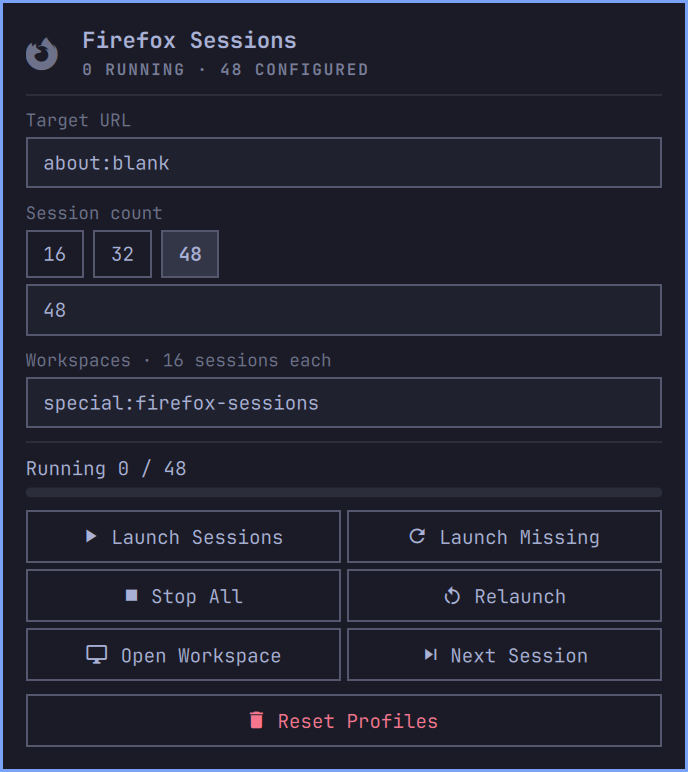

# Firefox Sessions for Omarchy v4

Firefox Sessions is an Omarchy-styled Quickshell bar plugin and an independent CLI. It launches isolated Firefox instances, places them across Hyprland workspaces, and manages only the processes that it started.



## Architecture

```text
Quickshell panel
      │ JSON lines and status
      ▼
firefox-sessions CLI
      ├── XDG configuration
      ├── PID, start-time, and profile tracking
      ├── Firefox processes with one profile and window class each
      └── hyprctl placement and focus
```

The panel contains presentation only. The Python CLI owns configuration, launch staggering, process identity, profile deletion, and Hyprland actions. The CLI does not use `pkill`, process-name matching, or a global Firefox window rule.

Each session uses:

```text
firefox --new-instance --no-remote \
  --profile ~/.local/share/firefox-sessions/profile-XX \
  --name firefox-sessions-XX \
  --class firefox-sessions-XX \
  --new-window URL
```

Current Firefox documentation states that `--new-instance` opens a separate instance, `--profile` selects a profile path, and `--new-window` opens the URL. `--no-remote` is included for compatibility. Unique `--name` and `--class` values let Hyprland identify managed windows on native Wayland and XWayland.

## Install on Omarchy v4

Requirements: Omarchy v4 with the Quattro shell, Python 3.10 or later, Firefox on `PATH`, and Hyprland with `hyprctl`. The plugin uses the Quickshell installation supplied by Omarchy. No Python packages or administrator permissions are required.

```bash
omarchy plugin add https://github.com/HarryParkes/omarchy-firefox-launcher.git --enable
```

The panel uses the Python manager inside the plugin directory. A separate CLI installation is not required. Omarchy installs the plugin under `~/.config/omarchy/plugins/io.github.harryparkes.firefox-sessions/`.

To update it:

```bash
omarchy plugin update io.github.harryparkes.firefox-sessions
```

No Omarchy core file or Hyprland configuration file is changed. Enabling the plugin changes the bar layout through Omarchy's plugin commands.

### Optional CLI

For a separate `firefox-sessions` command:

```bash
git clone https://github.com/HarryParkes/omarchy-firefox-launcher.git
cd omarchy-firefox-launcher
./install.sh
```

This installs only the CLI in user-owned locations:

```text
~/.local/bin/firefox-sessions
~/.local/lib/firefox-sessions/
```

Add `~/.local/bin` to `PATH` if necessary. Run `git pull --ff-only` and `./install.sh` to update this separate CLI.

### Upgrade from the old installer

The old installer copied the panel without a Git checkout. Stop managed sessions, remove that copy, then use the standard install command above:

```bash
firefox-sessions stop
omarchy plugin remove io.github.harryparkes.firefox-sessions
```

Keep profiles and configuration. If you used an older version with scheduling, disable its timers before updating. The new installer does not delete timers or schedule files.

## Launch and use

Select the Firefox glyph in the Omarchy bar. The panel provides:

- persisted target URL;
- 16, 32, and 48 presets, with 48 as the default;
- a custom count from 1 to 999;
- equal grids with up to 16 sessions per workspace;
- Launch Sessions and Launch Missing;
- Stop All, Relaunch, and confirmed Reset Profiles;
- Open Workspace and Next Session;
- running count and launch progress.

Launch Sessions and Launch Missing are both safe ensure operations. They start only missing session numbers. Relaunch stops all managed sessions and starts the configured set again.

Start with a small custom count. The default is 48 separate Firefox instances, which can use substantial memory and CPU time. Each profile stores cookies, history, credentials, and other browser data. Do not add profiles or configuration containing private URLs to this repository.

The CLI works without Quickshell:

```bash
firefox-sessions launch --count 48 --url "https://example.com"
firefox-sessions status
firefox-sessions focus
firefox-sessions next
firefox-sessions stop
firefox-sessions relaunch
firefox-sessions reset --yes
```

## Multiple workspaces

Enter a comma-separated workspace list in the panel or CLI:

```bash
firefox-sessions configure --workspaces "4,5,6"
firefox-sessions configure --workspaces "special:firefox-sessions"
firefox-sessions configure --workspaces "special:research-a,special:research-b"
```

Sessions are assigned in groups of 16 and arranged in equal grids. For example, sessions 1–16 use workspace `4`, sessions 17–32 use `5`, and sessions 33–48 use `6`. If the configured list is too short, numeric workspaces continue in sequence and named workspaces get a numeric suffix. Open Workspace cycles through every used workspace. Running Launch Sessions again also reapplies placement to existing managed windows.

The default is `special:firefox-sessions`. With 48 sessions, overflow uses `special:firefox-sessions-2` and `special:firefox-sessions-3`. A normal workspace value can be a positive number or a Hyprland workspace name. A special workspace must use `special:name`.

## Configuration and state

XDG locations are used when their environment variables are set:

```text
$XDG_CONFIG_HOME/firefox-sessions/config.json
$XDG_DATA_HOME/firefox-sessions/profile-XX
$XDG_RUNTIME_DIR/firefox-sessions/state.json
```

Defaults are `~/.config`, `~/.local/share`, and the current user runtime directory. Every profile has independent cookies, storage, cache, preferences, extensions, and browser state.

The runtime state records a PID, Linux process start time, exact profile path, and unique window class. Before sending a signal, the manager verifies all process identity data again. Stale PIDs and normal Firefox instances are ignored. Stop first sends `SIGTERM`, waits up to eight seconds, and uses `SIGKILL` only for a still-verified managed process.

Profile reset requires `--yes` in the CLI and a confirmation dialog in the panel. It canonicalises the XDG data path, rejects a symbolic-link profile root, stops managed sessions, and deletes only the Firefox Sessions profile root.

## Files in this repository

```text
install.sh
uninstall.sh
quickshell/Panel.qml
manifest.json
scripts/firefox-sessions
scripts/firefox_sessions.py
tests/test_manager.py
tests/test_distribution.py
README.md
LICENSE
```

## Remove

Stop managed sessions before removing the plugin. From its installed directory:

```bash
python3 ~/.config/omarchy/plugins/io.github.harryparkes.firefox-sessions/scripts/firefox_sessions.py stop
omarchy plugin remove io.github.harryparkes.firefox-sessions
```

This keeps profiles and configuration. Omarchy removal alone does not stop browser processes.

To delete all managed profiles and settings, run this before removing the plugin:

```bash
python3 ~/.config/omarchy/plugins/io.github.harryparkes.firefox-sessions/scripts/firefox_sessions.py reset --yes --configuration
```

Deletion is permanent. The manager checks both application paths before deleting either one and refuses symbolic-link roots.

For the optional CLI, run `./uninstall.sh` from a source checkout. It stops managed sessions and removes only the CLI. Use `./uninstall.sh --purge` to also delete profiles and settings, or `./uninstall.sh --purge --yes` for unattended deletion. Remove the panel separately with Omarchy.

## Development and checks

```bash
python3 -m unittest discover -s tests -v
sh -n install.sh uninstall.sh scripts/firefox-sessions
omarchy plugin validate .
qmllint -I /usr/share/omarchy/shell quickshell/Panel.qml
```

The tests use temporary user directories and test processes. They cover launch identity, workspace assignment, configuration, CLI install and update, removal, and guarded profile deletion. CI runs the tests, shell syntax checks, and a pinned official Omarchy manifest validator. QML checks require an installed Omarchy shell.

Before each release, test real Firefox launch, workspace placement, panel controls, Escape, shell open and close, disable and enable, shell restart, update, and removal on Omarchy. Automated tests do not replace these desktop checks.

Local checks on 30 September 2026 passed on Omarchy 4.0.4-1 and Hyprland 0.56.2: 17 tests on Python 3.10, shell syntax, both installed and pinned manifest validators, QML lint, panel rendering and configuration refresh, shell open and close, disable and enable, and two real Firefox instances with automatic workspace placement and equal sizing. The original user settings were restored after the preview capture. A fresh remote plugin install, Git-based plugin update, and shell restart still need release checks.

## Publication

The repository must be public before marketplace submission. Check tracked files and Git history for private data before changing visibility. Run the checks above, push the tested source, and create a release tag that matches the manifest version.

Submit through the [Omarchy plugin issue form](https://github.com/omacom/omarchy-plugin-marketplace/issues/new?template=submit-plugin.yml):

- Repository: `https://github.com/HarryParkes/omarchy-firefox-launcher`
- Category: `Productivity`
- Tags: `Launcher`, `Workspaces`, `Quickshell`
- Dependencies: Omarchy v4 Quattro, Python 3.10 or later, Firefox, and Hyprland.
- Permissions: user account only; no administrator privileges, services, or remote builds.
- Preview: `preview.png` at the repository root.

Marketplace approval lists the plugin; it is not a security review.

## License and support

MIT; see [LICENSE](LICENSE). Report faults through GitHub issues. Include your Omarchy and Firefox versions, the action that failed, and the error text. Remove private URLs and browser data from reports. Plugins run without a sandbox under your user account; review the code before enabling it.
